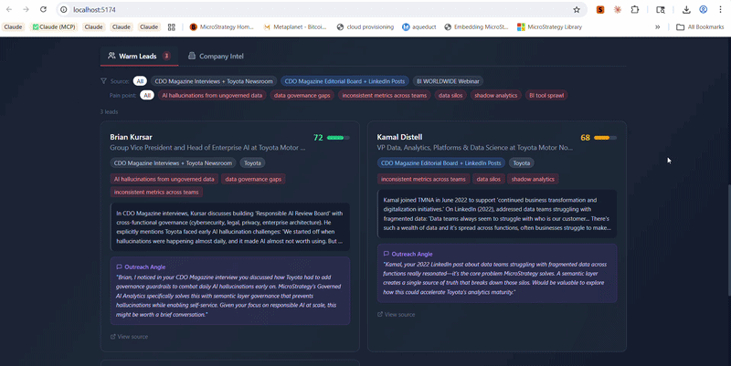

# Account Research Engine

AI-powered account research tool for enterprise sales. Analyzes companies and maps findings to GTM themes with persona-specific talking points, competitive intelligence, and email draft generation.




## Features

### Core Research
- AI-powered company research via Claude API with web search
- 8 GTM theme mapping with relevance scoring and visual bars
- 5 buyer persona filtering with priority theme ordering
- Fast mode (training data, ~15s) vs Full mode (live web search, 30-90s)
- Evidence citations with source attribution
- Persona-specific talking points and discovery questions

### Warm Lead Finder
- Finds real people publicly signaling pain points your product solves
- Sources: LinkedIn posts, Reddit, company blogs, conference speakers, job postings
- Relevance scoring and personalized outreach angles
- CSV export and clipboard copy for outreach

### Competitive Install Detection
- Detects BI/analytics tools from job postings (Tableau, Power BI, Looker, Qlik, Databricks, Snowflake, and 30+ more)
- Confidence-rated evidence (High/Medium/Low)
- Strategic implications mapped to GTM themes

### Email Draft Generator
- 3 templates: Cold Outreach, Meeting Follow-Up, Executive Briefing
- Persona-aware tone and content referencing specific research findings
- Editable drafts with copy to clipboard

### Research History
- Persistent localStorage history with search and filter
- One-click reload of past research
- API response caching (30-minute expiry) for instant re-access

### PDF Export
- Professional one-pager with company header, theme summary, talking points, discovery questions, and competitive landscape
- Strategy brand colors and layout

### UI/UX
- Dark mode interface with slate/red color scheme
- Skeleton loading states during API calls
- Animated theme cards with visual relevance bars
- Full mobile responsiveness
- Keyboard shortcuts (Cmd+K to focus search, Enter to research, Escape to clear)
- Toast notification system for actions and errors

## Quick Start

### Prerequisites
- Node.js 18+
- Anthropic API key ([get one here](https://console.anthropic.com/))

### Installation

```bash
git clone https://github.com/tzockoll-creator/AccountBasedResearch.git
cd AccountBasedResearch

npm install

cp .env.example .env
# Edit .env and set: VITE_ANTHROPIC_API_KEY=sk-ant-...

npm run dev
```

### Environment Variables

| Variable | Required | Description |
|----------|----------|-------------|
| `VITE_ANTHROPIC_API_KEY` | Yes | Anthropic API key for Claude |

## Deployment

### Vercel (Recommended)

[](https://vercel.com/new/clone?repository-url=https://github.com/tzockoll-creator/AccountBasedResearch)

1. Click the deploy button or import the repo in Vercel
2. Add `VITE_ANTHROPIC_API_KEY` as an environment variable
3. Deploy

### Netlify

1. Connect your repo in Netlify
2. Build command: `npm run build`
3. Publish directory: `dist`
4. Add `VITE_ANTHROPIC_API_KEY` in environment variables

### Manual

```bash
npm run build
# Serve the dist/ directory with any static file server
npx serve dist
```

## Architecture

```
src/
  components/
    App.jsx                   # Main WarmLead AI interface
    AccountResearchApp.jsx    # Account research with GTM theme mapping
    CompanySearch.jsx          # Search input with keyboard shortcuts
    CompanyIntel.jsx           # Company research display
    LeadsGrid.jsx              # Warm leads grid with filtering
    ProductConfig.jsx          # Customizable product configuration
    ExportButton.jsx           # CSV export and clipboard copy
    StatusBar.jsx              # Real-time search status indicator
  config/
    themes.js                  # 8 GTM theme definitions with signals
    personas.js                # 5 buyer persona definitions
    defaultProduct.js          # Strategy product preset
  hooks/
    useResearchHistory.js      # localStorage-based research history
  services/
    claudeApi.js               # Claude API wrapper with retry logic
    exporters.js               # CSV generation and clipboard utilities
  utils/
    competitiveDetection.js    # Job posting analysis for tech stack
    pdfExport.jsx              # PDF one-pager generation
  App.jsx                      # Entry point
  index.css                    # Tailwind + custom styles
evals/                         # Evaluation framework for lead quality
```

### Key Technical Decisions

- **Browser-only**: Calls Claude API directly (no backend needed for demo)
- **localStorage**: All persistence (history, config, preferences)
- **Tailwind CSS**: Utility-first styling with custom color theme
- **@react-pdf/renderer**: Client-side PDF generation
- **Exponential backoff**: Automatic retry on 429 rate limits

## GTM Themes

| Theme | Description |
|-------|-------------|
| Governed AI | AI grounded in trusted data vs. hallucination risk |
| Single Source of Truth | Consistent metrics across the organization |
| Trust at Scale | Enterprise security, governance, and auditability |
| Self-Service Without Chaos | Empower users without shadow analytics |
| Time-to-Insight | Faster decisions through governed data |
| TCO / Consolidation | Replace fragmented BI stack with unified platform |
| Controlled Costs | Predictable analytics spend |
| Portability & Flexibility | Avoid vendor lock-in, multi-cloud freedom |

Themes are configurable in `src/config/themes.js`.

## Buyer Personas

| Persona | Priority Themes |
|---------|-----------------|
| CIO/CTO | Portability, TCO, Trust, Governed AI |
| CFO/Finance | Controlled Costs, TCO, Trust, Single Source of Truth |
| CDO/Data Leader | Single Source of Truth, Governed AI, Trust, Self-Service |
| COO/Operations | Time-to-Insight, Self-Service, Single Source of Truth, Costs |
| Business User | Self-Service, Time-to-Insight, Governed AI, Portability |

Personas are configurable in `src/config/personas.js`.

## Contributing

See [CONTRIBUTING.md](CONTRIBUTING.md) for setup instructions and development guidelines.

## License

MIT License - see [LICENSE](LICENSE) for details.

---

Built for enterprise sales engineering.
